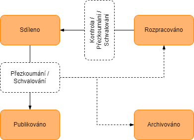

# POŽADAVKY NA VÝMĚNU INFORMACÍ (EIR)
**Projekt**: `[Název projektu]`

**Objednatel**: `[Název objednatele]`

**Vytvořil**: `BIM Consulting s.r.o.`

**Verze**: 01

# Obsah

- [1. Úvod](#1-úvod)
  - [1.1. Pojmy a zkratky](#11-pojmy-a-zkratky)
  - [1.2. Použité normy](#12-použité-normy)
  - [1.3. Hierarchie požadavků na informace](#13-hierarchie-požadavků-na-informace)
- [2. Předmět projektu](#2-předmět-projektu)
  - [2.1. Informace o projektu](#21-informace-o-projektu)
  - [2.2. Kontaktní osoby na straně objednatele](#22-kontaktní-osoby-na-straně-objednatele)
  - [2.3. Cíle projektu](#23-cíle-projektu)
- [3. Požadavky na informace a stanovení úrovně informačních potřeb](#3-požadavky-na-informace-a-stanovení-úrovně-informačních-potřeb)
  - [3.1. Pravidelné pracovní schůzky](#31-pravidelné-pracovní-schůzky)
  - [3.2. Projekt povolení záměru](#32-projekt-povolení-záměru)
  - [3.3. Projekt pro provádění stavby](#33-projekt-pro-provádění-stavby)
  - [3.4. Projekt skutečného provedení stavby](#34-projekt-skutečného-provedení-stavby)
  - [3.5. Správa a provoz objektu](#35-správa-a-provoz-objektu)
- [4. Akceptační kritéria](#4-akceptační-kritéria)
- [5. Projektový plán prací](#5-projektový-plán-prací)
  - [5.1. Body klíčových rozhodnutí, etapy projektu](#51-body-klíčových-rozhodnutí-etapy-projektu)
  - [5.2. Projektové milníky pro předávání informací](#52-projektové-milníky-pro-předávání-informací)
- [6. Projektový informační standard](#6-projektový-informační-standard)
  - [6.1. Výměna informací prostřednictvím CDE](#61-výměna-informací-prostřednictvím-cde)
  - [6.2. Klasifikace a identifikace](#62-klasifikace-a-identifikace)
  - [6.3. Metoda přiřazování úrovně informačních potřeb](#63-metoda-přiřazování-úrovně-informačních-potřeb)
- [7. Projektové metody a postupy pro vytváření informací](#7-projektové-metody-a-postupy-pro-vytváření-informací)
  - [7.1. Obecná pravidla](#71-obecná-pravidla)
  - [7.2. Osový systém](#72-osový-systém)
  - [7.3. Podlaží](#73-podlaží)
  - [7.4. Umístění modelu](#74-umístění-modelu)
  - [7.5. Jednotky hodnot veličin](#75-jednotky-hodnot-veličin)
  - [7.6. Digitální model stavby](#76-digitální-model-stavby)
  - [7.7. Výkaz výměr](#77-výkaz-výměr)
  - [7.8. 2D dokumentace generovaná z digitálního modelu stavby](#78-2d-dokumentace-generovaná-z-digitálního-modelu-stavby)
  - [7.9. Způsob koordinace](#79-způsob-koordinace)
  - [7.10. Předání informací](#710-předání-informací)
  - [7.11. Postup prací pro CDE](#711-postup-prací-pro-cde)
  - [7.12. Schvalovací procesy v CDE](#712-schvalovací-procesy-v-cde)
- [Přílohy](#přílohy)
  - [EIR Příloha A: Projektový datový standard](#eir-příloha-a-projektový-datový-standard)
  - [EIR Příloha B: Geometrická podrobnost prvků](#eir-příloha-b-geometrická-podrobnost-prvků)
  - [EIR Příloha C: Adresářová struktura a přístupy](#eir-příloha-c-adresářová-struktura-a-přístupy)

# 1. Úvod

Požadavky na výměnu informací stanovují aspekty předávaných projektových informací, které potřebuje objednatel v průběhu projektu a realizace, jakož i ostatní členové projektového týmu, k přijímání kvalifikovaných rozhodnutí nezbytných pro další směřování projektu. Tyto požadavky se týkají konkrétního dodavatele v rámci celého projektu, tedy všech jeho etap.

## 1.1. Pojmy a zkratky

| **Pojem/Zkratka** | **Definice** |
|---|---|
| **Dodavatel / Zhotovitel** | Strana uvedená ve smlouvě, která nabízí poskytnutí dodávek, služeb nebo stavebních prací a je Dodavatelem dle zákona. Dodavatel je vedoucí pověřenou stranou dle ČSN EN ISO 19650. |
| **Koordinátor BIM** | Osoba na straně Dodavatele odpovědná za kontrolu plnění požadavků na informace v rámci managementu informací s využitím metody BIM. |
| **Objednatel** | Strana uvedená ve smlouvě, která přijala nabídku zhotovitele a je zadavatelem podle zákona o zadávání veřejných zakázek. Objednatel je pověřující stranou dle ČSN EN ISO 19650. |
| **Projektový manažer BIM** | Osoba na straně Objednatele odpovědná za kontrolu plnění požadavků na informace v rámci managementu informací s využitím metody BIM. |
| **Projektový tým** | Všechny osoby účastnící se projektu na straně objednatele, zhotovitele (zhotovitelů) a subdodavatelů / podzhotovitelů. |
| **Realizační tým** | Všechny osoby účastnící se na projektu na straně zhotovitele a jeho subdodavatelů. V rámci projektového týmu je jeden nebo více realizačních týmů. |
| **Správce datového prostředí** | Osoba na straně Objednatele odpovědná za správu a provoz společného datového prostředí (CDE). |
| **Subdodavatel / Podzhotovitel** | Strana poskytující dodávky Dodavateli. Subdodavatel / Podzhotovitel je pověřenou stranou podle ČSN EN ISO 19650. |
| **Úkolový tým** | Všechny osoby účastnící se na projektu na straně jednoho subdodavatele. V rámci realizačního týmu je zpravidla jeden nebo více úkolových týmů. |
| **AIM** | Informační model aktiva (informační model stavby týkající se provozní fáze, správy a údržby nemovitosti). |
| **AIR** | Požadavky na informace o aktivu (Asset Information Requirements). |
| **BEP** | Plán realizace BIM (BIM Execution Plan). |
| **BIM** | Informační modelování staveb (Building Information Modeling). |
| **BIM protokol** | Dokument, který stanovuje pravidla pro zajištění efektivní výměny dat prostřednictvím digitální platformy CDE v rámci BIM projektu a upravuje práva a povinnosti Objednatele, Zhotovitele a dalších uživatelů. |
| **Bpv** | Systém nadmořských výšek Jednotné nivelační sítě SR, tj. baltský výškový systém po vyrovnání. |
| **CDE** | Společné datové prostředí (Common Data Environment). |
| **Digitální model rozestavěnosti** | Digitální model stavby doplněný o informace u jednotlivých prvků popisující, zda byl již prvek na stavbě realizován / instalován nebo model, který obsahuje pouze části, které byly na stavbě již realizovány / instalovány. |
| **DiMS** | Digitální informační model stavby. |
| **DSPS** | Dokumentace skutečného provedení stavby. |
| **EIR** | Požadavky na výměnu informací (Exchange Information Requirements); pojem nahradil starší Požadavky objednatele na informace (Employer´s Information Requirements). |
| **HSV** | Hlavní stavební výroba. |
| **IDS** | Information Delivery Specification je otevřený, strojově čitelný formát pro přesné definování požadavků na data v infomračním modelu ve fromát `.ifc`|
| **IMS** | Informační model stavby. |
| **OIR** | Požadavky organizace na informace (Organizational Information Requirements). |
| **PIM** | Projektový informační model (informační model stavby týkající se dodací fáze, projektu a realizace). |
| **PIR** | Požadavky na projektové informace (Project Information Requirements). |
| **PSV** | Přidružená stavební výroba. |
| **S-JTSK** | Souřadnicový systém Jednotné trigonometrické sítě katastrální Křovákův systém. |
| **TDS** | Technický dozor stavebníka – osoba odpovědná za kontrolu souladu a jakosti prováděných prací se záměrem stavebníka při navrhování – projektování, nebo se schválenou projektovou dokumentací při provádění stavby. |
| **TZB** | Technické zařízení budov. |

## 1.2. Použité normy

Tento dokument vychází z částí níže uvedených norem.

Je-li se v tomto dokumentu odvoláváno na ustanovení normy, týká se to pouze přímo uvedeného ustanovení, nikoliv celého znění normy.

| **Norma** | **Název** |
|---|---|
| **ČSN EN ISO 19650** | Organizace a digitalizace informací o budovách a inženýrských stavbách včetně informačního modelování staveb (BIM) (soubor norem). |
| **ČSN EN 17817-1** | Informační modelování staveb – Úroveň informačních potřeb – Část 1: Pojmy a principy. |
| **ČSN EN ISO 16739-1** | Datový formát Industry Foundation Classes (IFC) pro sdílení dat ve stavebnictví a facility managementu. |
| **ČSN EN ISO 12006** | Budovy a inženýrské stavby – Organizace informací o stavbách. |

## 1.3. Hierarchie požadavků na informace

Členění tohoto dokumentu vychází z hierarchie požadavků na informace podle ČSN EN ISO 19650-1.

Pro dodací fází (projekt a realizaci stavby) přispívají požadavky organizace na informace (OIR) do požadavků na projektové informace (PIR), ty následně přispívají do požadavků na výměnu informací (EIR). EIR specifikují projektový model stavby (PIM).

Pro provozní fázi (správa a údržba nemovitostí) jsou vytvářeny požadavky na informace o aktivu, které rovněž přispívají do požadavků na výměnu informací (EIR) a specifikují informační model aktiva (AIM).

Informace z projektového informačního modelu (PIM) na konci dodací fáze přispívají do informačního modelu aktiva (AIM). V českém kontextu se tyto informační modely označují jako informační modely stavby (IMS).

*POZN. 1: V tomto dokumentu jsou již zahrnuty požadavky organizace na informace (OIR), požadavky na informace o aktivu (AIR) a projektové informace (PIR).*

# 2. Předmět projektu

*[Popis projektu]*

## 2.1. Informace o projektu

**Popis projektu**

*[Podrobný popis projektu]*

**Místo stavby**

- **Adresa**: *[Adresa stavby]*
- **Katastrální území a parcelní čísla**: *[Katastrální údaje]*

**Kontaktní adresa objednatele**

- **Objednatel**: `[Název objednatele]`
- **Ulice, č.p.**: *[Adresa]*
- **Město**: *[Město]*
- **PSČ**: *[PSČ]*

## 2.2. Kontaktní osoby na straně objednatele

| **Role BIM** | **Organizace** | **Jméno** | **E-mail** | **Telefon** |
|---|---|---|---|---|
| **Projektový manažer BIM** |  |  |  |  |
| **Správce datového prostředí** |  |  |  |  |

## 2.3. Cíle projektu

V této kapitole jsou vypsány jednotlivé cíle projektu z pohledu uplatnění metody BIM a zároveň obsahu informací o tom, pro jaké účely budou vytvářené informace využity.

Záměrem objednatele je splnění těchto cílů:

- Eliminace rizik, kterými jsou:
  - časové prodlevy v projektové přípravě a při realizaci stavby
  - vícepráce během stavby,
  - nesoulad 2D dokumentace a informačního modelu.
- Lepší efektivita procesů a komunikace během realizace stavby pomocí řízených komunikačních toků.
- Sledování aktuální rozestavěnosti.
- Tvorba 2D dokumentace skutečného provedení přímo z informačního modelu.
- Prostorová koordinace – detekce kolizí týkající se zejména změn během výstavby a digitálního modelu skutečného provedení stavby.
- Tvorba strukturovaných informací pro správu a údržbu, která umožní nasazení systému CAFM.
- Tvorba podkladů pro vytvoření výkazu výměr (nikoliv soupisu prací) přímo z modelu.

Výše jmenované cíle jsou postupně plněny v rámci zhotovování dokumentací stavby dle aktuálně platné legislativy, zejména stavebního zákona a jeho prováděcích vyhlášek.

Vytvářené informace budou sloužit k následujícím účelům:

### Projektová dokumentace pro povolení záměru (DPZ)

- Vytvoření projektové dokumentace a další podklady pro projednání záměru s účastníky řízení, dotčenými orgány státní správy, vlastníky a správci sítí technické a dopravní infrastruktury a vydání správního rozhodnutí.
- Vytvoření výkazu výměr svislých a vodorovných nosných konstrukcí, dělících konstrukcí (příčky) se základní materiálovou skladbou, nenosné konstrukce (podlahy, střecha apod.) dle rozsahu a odsouhlasení.
- Prostorová koordinace hlavních konstrukcí a hlavních tras TZB.
- Vyhotovení vizualizací záměru.

### Projektová dokumentace a další podklady pro provádění stavby (DPS)

- Vytvoření výkazu výměr HSV a PSV (vyjma předem odsouhlasených výjimek).
- Kompletní prostorová koordinace všech konstrukcí a TZB.
- Vyznačení servisních, údržbových, přístupových a montážních prostorů prvků TZB.

### Realizace stavby

- Projektová dokumentace (realizační a dílenská dokumentace) a další podklady pro provádění stavby.
- Prostorová koordinace všech konstrukcí a TZB změněných vůči DPS.

### Správa budovy v CAFM systému

- Projektová dokumentace a další podklady skutečného provedení.
- Naplnění CAFM systému daty vzniklých v průběhu realizace.
- Propojení CAFM systému s digitálním modelem stavby.

Pro zajištění těchto účelů jsou v tomto dokumentu stanoveny požadavky na konkrétní informace.

# 3. Požadavky na informace a stanovení úrovně informačních potřeb

Tato část se zabývá stanovením pravidelných pracovních schůzek a úrovní informačních potřeb pro různé stupně dokumentace a fáze projektu.

Obecně však platí, že na informační modely stavby (IMS) jsou kladeny obdobné požadavky jako na výkresovou 2D dokumentaci dle platné legislativy a informační modely stavby jsou navíc obsahově v souladu s tímto dokumentem a jeho přílohou EIR_Příloha A_Projektový datový standard.

## 3.1. Pravidelné pracovní schůzky

**Účely pravidelných pracovních schůzek:**

- Předání dílčích informačních modelů stavby a dalších dokumentů odpovídající úrovni informačních potřeb dle fáze projektu a aktuální rozpracovanosti pro účely:
  - průběžné kontroly,
  - kontroly kolizí,
  - kontroly postupu výstavby a rozestavěnosti,
  - kontroly harmonogramu.
- Předání všech modelů a dokumentů, které jsou ke dni milníku pro předávání informací rozpracovány či dokončeny, a budou následně odevzdávány na konci etapy projektu.
- Předání modelů a dokumentů, které od poslední pracovní schůzky neprošly žádnou změnou (v rámci CDE tedy existují ve stávající revizi).

## 3.2. Projekt pro povolení záměru

**Informační model stavby v úrovni informačních potřeb:**

- Digitální informační model bude obsahovat geometrické informace v detailní podrobnosti podle kap. [6. Projektový informační standard](#6-projektový-informační-standard).
- Digitální informační model bude obsahovat alfanumerické informace v rozsahu a formátu podle EIR_Příloha A_Projektový datový standard, list tabulky „Třídící systém".
- Digitální informační model bude obsahovat alfanumerické informace (vlastnosti) v rozsahu a formátu podle přílohy EIR_Příloha A_Projektový datový standard, list tabulky „Projektový datový standard".
- Projektová dokumentace v rozsahu nezbytném pro naplnění zamýšlených účelů pro použití informací uvedených v tomto dokumentu. Rozsah a obsah dokumentace pro vydání společného povolení bude odpovídat požadavkům dle platné legislativy. Dokumentace bude v maximálním možném rozsahu exportována přímo z informačního modelu stavby; grafická část bude exportována přímo z digitálního modelu stavby minimálně v rozsahu:
  - Půdorysy všech nadzemních podlaží (případně typického podlaží) v měřítku min. 1:100.
  - Schématické charakteristické pohledy v měřítku min. 1:100.
  - Schématické charakteristické řezy v měřítku min. 1:100.

## 3.3. Projekt pro provádění stavby

**Informační model stavby v úrovni informačních potřeb:**

- Digitální informační model bude obsahovat geometrické informace ve výrobní podrobnosti podle kap. [6. Projektový informační standard](#6-projektový-informační-standard).
- Digitální informační model bude obsahovat alfanumerické informace v rozsahu a formátu podle EIR_Příloha A_Projektový datový standard, list tabulky „Třídící systém".
- Digitální informační model bude obsahovat alfanumerické informace (vlastnosti) v rozsahu a formátu podle přílohy EIR_Příloha A_Projektový datový standard, list tabulky „Projektový datový standard".
- Projektová dokumentace v rozsahu nezbytném pro naplnění zamýšlených účelů pro použití informací uvedených v tomto dokumentu. Rozsah a obsah dokumentace pro provádění stavby bude odpovídat požadavkům dle platné legislativy. Dokumentace bude v maximálním možném rozsahu exportována přímo z informačního modelu stavby; grafická část bude exportována přímo z digitálního modelu stavby minimálně v rozsahu:
  - Půdorysy všech nadzemních podlaží (případně typického podlaží) v měřítku min. 1:50.
  - Schématické charakteristické pohledy v měřítku min. 1:50.
  - Schématické charakteristické řezy v měřítku min. 1:50.
- Součástí informačního modelu stavby bude výkaz výměr generovaný z digitálního modelu stavby. Výkaz výměr bude sloužit jako jeden z podkladů pro sestavení rozpočtu. Více viz. kapitola [7.7. Výkaz výměr](#77-výkaz-výměr).

## 3.4. Projekt skutečného provedení stavby

**Informační model stavby v úrovni informačních potřeb bude splňovat následující požadavky:**

- Digitální model bude obsahovat geometrické informace v detailní podrobnosti podle kap. [6. Projektový informační standard](#6-projektový-informační-standard) s úrovní přesnosti ≤ 50 mm.
- Digitální model bude vznikat průběžně již během výstavby za účelem kontroly rozestavěnosti viz. kap. [5.1. Body klíčových rozhodnutí, etapy projektu](#51-body-klíčových-rozhodnutí-etapy-projektu) a kap. [5.2. Projektové milníky pro předávání informací](#52-projektové-milníky-pro-předávání-informací) jako tzv. modely rozestavěnosti.
- Z modelů rozestavěnosti bude patrná aktuální prostavěná část stavby k daným termínům milníku. Způsob, jakým bude rozestavěnost v modelech znázorněna je ponechána na Zhotoviteli, který jej určí do BEP.
- Digitální informační model bude obsahovat alfanumerické informace v rozsahu a formátu podle EIR_Příloha A_Projektový datový standard, list tabulky „Projektový datový standard".
- Projektová dokumentace bude v rozsahu nezbytném pro naplnění zamýšlených účelů pro použití informací uvedených v tomto dokumentu. Rozsah a obsah dokumentace skutečného provedení stavby bude odpovídat požadavkům aktuálně platné legislativy. Dokumentace bude v maximálním možném rozsahu exportována přímo z informačního modelu stavby; grafická část bude exportována přímo z digitálního modelu stavby minimálně v rozsahu:
  - Půdorysy všech podlaží v měřítku shodném s prováděcí dokumentací.
  - Schématické charakteristické pohledy v měřítku shodném s prováděcí dokumentací.
  - Schématické charakteristické řezy v měřítku shodném s prováděcí dokumentací.
- K prvkům v modelu budou ukládány související soubory viz. kap. [6.1.4. Konvence pojmenování souvisejících dokumentů](#614-konvence-pojmenování-souvisejících-dokumentů) do předem stanovené lokace ve složkové struktuře v CDE. Tyto soubory budou ukládány jak do CDE, tak do CAFM řešení. Pokud to vybrané CDE a CAFM umožní, lze dokumenty nahrát nejdříve do CDE a poté automaticky se zachováním vazeb na základě pojmenování (mezi prvkem modelu a konkrétním dokumentem) přesunout do CAFM. Na tomto přenosu spolupracuje správce CAFM se Zhotovitelem.

## 3.5. Správa a provoz objektu

**Úroveň informačních potřeb bude splňovat minimálně tyto požadavky:**

- Informační model stavby v úrovni informačních potřeb bude přejímat požadavky z projektu Skutečného provedení stavby.
- V případě, že vybrané CAFM řešení bude vyžadovat doplnění vlastního klasifikačního a identifikačního systému za účelem propojení digitálního modelu s CAFM řešením, bude tento systém doplněn k příslušným prvkům v modelu.
- Alfanumerické informace k prvkům, které jsou součástí modelu skutečného provedení stavby, se budou přebírat z modelu (např. kód prvku, název prvku, jeho rozměry, informace o ploše, objemu, materiálu). Požadované parametry pro správu a údržbu, které se v informačním modelu ani nenacházejí, budou vyplněny rovnou do CAFM řešení. Typicky se bude jednat o alfanumerické informace specifické pro dané CAFM řešení a správu a provoz objektu (např. datum poslední revize, datum uvedení do provozu, délka záruční doby, …).
- Pro představu pracnosti se dá tvrdit, že pro každý prvek v informačním modelu (hlavně profesní části) bude potřeba vyplnit do 10 alfanumerických informací do CAFM konzole. Toto vyplňování se však dá automatizovat a bude na Projektovém manažerovi BIM a Koordinátorovi BIM dořešit způsob automatizace při vyplňování, které bude podléhat způsobu práce Zhotovitele a jeho subdodavatelskému řetězci. Doporučujeme, aby tuto povinnost vyplňování přenesl Zhotovitel na svůj dodavatelský řetězec a na svojí straně už prováděl jenom kontrolní činnost. CAFM konzole umožňuje průběžnou kontrolu vyplněnosti k jednotlivým prvkům, funkčním částem či logickým celkům.
- K prvkům se zároveň do CAFM nahrávají i příslušné dokumenty prvku viz. kap. [6.1.4. Konvence pojmenování souvisejících dokumentů](#614-konvence-pojmenování-souvisejících-dokumentů).
- Podrobný rozsah parametrů k jednotlivým prvkům bude předán nejpozději do 12 měsíců před plánovaným dokončením realizace Díla.
- Pokud to vybrané CDE a CAFM umožní, lze alfanumerické informace nahrávat nejdříve do CDE a poté automaticky se zachováním vazeb přesunout do CAFM.

# 4. Akceptační kritéria

Informační model stavby musí odpovídat požadavkům stanoveným v kapitolách [6. Projektový informační standard](#6-projektový-informační-standard) a [7. Projektové metody a postupy pro vytváření informací](#7-projektové-metody-a-postupy-pro-vytváření-informací). Jakékoliv odchylky od těchto požadavků musí být předem projednány a odsouhlaseny Objednatelem a zdokumentovány v Plánu realizace BIM (BEP).

# 5. Projektový plán prací

Projektový plán prací stanovují etapy projektu na základě Smlouvy o dílo. V tomto dokumentu jsou zohledněny pouze ty etapy, u kterých dochází k vytváření, předávání a využívání informací metodou BIM.

## 5.1. Body klíčových rozhodnutí, etapy projektu

Konec každé etapy projektu je zároveň bodem klíčového rozhodnutí, ve kterém objednatel potřebuje učinit informovaná rozhodnutí zásadní pro další směřování projektu.

Smlouvou o dílo jsou stanoveny tyto etapy projektu, u kterých budou informace vytvářeny, předávány a využívány metodou BIM:

| **Etapa / bod klíčového rozhodnutí** | **Popis** | **Smluvní termín** |
|---|---|---|
| **Pravidelné pracovní schůzky** | Pravidelně 1x za 30 dní | *[Termín]* |
| **Informačních modelů rozestavěnosti** | Pravidelně 1x za 90 dní | *[Termín]* |
| **E1** | Projekt povolení stavby (DSP) | *[Termín]* |
| **E2** | Projekt pro provádění stavby (DPS) | *[Termín]* |
| **E3** | Projekt skutečného provedení stavby | Ke dni předání Díla |
| **E4** | Předání informací pro správu a údržbu budovy v CAFM systému | Ke dni předání Díla |

## 5.2. Projektové milníky pro předávání informací

V rámci každé etapy se stanoví jeden či více milníků pro předávání informací, ke kterým bude docházet k výměnám informací v rozsahu a formě dle požadavků na informace.

Milníky pro předávání informací se vztahují:

- ke každému klíčovému bodu rozhodnutí / konci etapy,
- k pravidelným pracovním schůzkám.

Milníky pro předávání informací jsou stanovovány v dostatečném předstihu před konáním pravidelné pracovní schůzky nebo před bodem klíčového rozhodnutí, aby bylo možno provést kontrolu kolizí a další přezkumy.

Kontroly kolizí budou vyhodnoceny do 1 týdne od předání podkladů (u průběžných kontrol vždy k termínu konání pracovní schůzky, u závěrečné kontroly 3 týdny před odevzdáním pro umožnění zapracování nedostatků po poslední pracovní schůzce).

| **Etapa / bod klíčového rozhodnutí** | **Termín odevzdání podkladů** |
|---|---|
| **Pravidelné pracovní schůzky** |  |
| Předání podkladů pro kontrolu rozpracovanosti | 1 den předem |
| Předání podkladů pro prostorovou koordinaci | 1 týden předem |
| **Informační modely rozestavěnosti** |  |
| Předání podkladů pro kontrolu rozpracovanosti | 1 den předem |
| Předání podkladů pro prostorovou koordinaci | 1 týden předem |
| **E1 Projekt pro povolení stavby** |  |
| Předání informací pro závěrečnou prostorovou koordinaci | 2 týdny předem |
| Odevzdání | Ke dni odevzdání |
| **E2 Projekt pro provádění stavby** |  |
| Předání informací pro závěrečnou prostorovou koordinaci | 2 týdny předem |
| Odevzdání | Ke dni odevzdání |
| **E3 Projekt skutečného provedení stavby** |  |
| Prostorová koordinace týkající se zejména změn během výstavby a digitálního modelu skutečného provedení stavby | 2 týdny předem |
| Odevzdání | Ke dni odevzdání |
| **E4 Předání informací pro správu a údržbu budovy v CAFM** |  |
| Odevzdání | Ke dni odevzdání |

# 6. Projektový informační standard

Níže jsou uvedeny všechny specifické informační standardy vyžadované organizací Objednatele. Schválené dodatky a změny projektového informačního standardu, týkající se konkrétního Dodavatele, budou obsaženy v Plánu realizace BIM (BEP).

## 6.1. Výměna informací prostřednictvím CDE

Tato kapitola se zabývá adresářovou strukturou v CDE, elektronickou výměnou informací z pohledu jednotlivých stavů dokumentů, jejich pojmenování včetně metadat a funkcemi a odpovědnostmi v rámci CDE.

### 6.1.1. Adresářová struktura

Navržená výchozí adresářová struktura společného datového prostředí, včetně přístupů dle jednotlivých rolí je součástí přílohy [EIR_Příloha B_Adresářová struktura a přístupy](#eir-příloha-b-adresářová-struktura-a-přístupy). Strukturu je možno po odsouhlasení zadavatelem v průběhu projektu rozšiřovat v rámci druhé a nižších úrovní.

### 6.1.2. Stavy dokumentů

Dokumenty se v rámci CDE budou nacházet v jednom z následujících stavů:

| **Stav** | **Popis** |
|---|---|
| **Rozpracováno** | Dokument je aktuálně rozpracován. K dokumentu může být omezen přístup jiným aktérům, než je autor. |
| **Sdíleno** | Dokument určený pro přezkoumání / schválení / autorizování. |
| **Publikováno** | Dokument určený pro použití dle účelu (například podklad pro realizaci). |
| **Archivováno** | Neaktuální dokument, nahrazený aktuálnější verzí. Archiv slouží pro audit vývoje dokumentů. |

Stavy dokumentů budou identifikovány dle funkcionality konkrétního CDE, které budou vybrány (obvykle pomocí metadat nebo s využitím složkové struktury).

Práce s informacemi s jednotlivých stavech je podrobně popsána v kap. [7.11. Postup prací pro CDE](#711-postup-prací-pro-cde) v rámci projektových metod a postupů pro vytváření informací.

### 6.1.3. Konvence pojmenování předávaných modelů a dokumentů

Pro efektivní práci na projektu je nezbytné, aby veškeré modely a dokumenty byly snadno vyhledatelné a identifikovatelné, aniž by byly závislé na struktuře a funkcionalitách společného datového prostředí (CDE). Použití konzistentní konvence identifikace informačních kontejnerů (konvence pojmenování) je klíčové pro dosažení tohoto cíle.

Veškeré modely a dokumenty vyměňované prostřednictvím CDE budou unikátně pojmenovány dle následující konvence. Kontrola splnění konvence pojmenování bude provedena automatickými nástroji při nahrávání souborů do CDE, pokud to dané CDE umožňuje.

**Systém pojmenování**

| **Pole 1** | **Pole 2** | **Pole 3** | **Pole 4** | **Pole 5** | **Pole 6** | **Pole 7** | **(Pole 8)** |
|---|---|---|---|---|---|---|---|
| Kód projektu | Stupeň | Stavební objekt | Profese | Část | Číslo | Revize (dle CDE) | Popis (volitelné) |
| XXX | XXXX | XX### | XXX | X | ### | R## | XXX… |

**Příklad:** `XXX-DSPS-SO01-AST-C-01-R01-Koordinační situace`

#### Oddělovače

Jednotlivé pole budou vzájemně odděleny oddělovačem.

Používán bude následující oddělovač polí: `-` (Hyphen-Minus, Unicode reference: U+002D).

#### Pole 1 – Kód projektu

Jedinečný identifikátor projektu.

Kód sestává ze 3 alfanumerických znaků, *[specifikovat kód projektu]*.

#### Pole 2 – Stupeň

Fáze projektu, zpravidla odpovídající etapě projektu dle kap. [5.1. Body klíčových rozhodnutí, etapy projektu](#51-body-klíčových-rozhodnutí-etapy-projektu).

Kód sestává ze 3-4 alfanumerických znaků:

| **Kód** | **Popis** |
|---|---|
| **DPZ** | Dokumentace pro povolení záměru |
| **DPS** | Projektová dokumentace pro provádění stavby |
| **DIL** | Dílenská dokumentace |
| **RDS** | Realizační dokumentace |
| **DSPS** | Dokumentace skutečného provedení stavby |

#### Pole 3 – Stavební objekt

Kód stavebního objektu případně provozního souboru.

Kód sestává z předpony `SO` pro stavební objekty, `IO` pro inženýrské objekty nebo `PS` pro provozní soubory a z čísla (bez mezery a oddělovače).

#### Pole 4 – Profese

Kód profese, resp. zpracovatele konkrétní profesní části.

Kód sestává ze 3 alfanumerických znaků:

| **Kód** | **Popis** |
|---|---|
| **ASR** | Architektonicko-stavební část |
| **STA** | Stavebně-konstrukční část |
| **VZT** | Vzduchotechnika |
| **CHL** | Rozvody chladu |
| **UT** | Rozvody tepla |
| **ZTI** | Zdravotně-technické instalace |
| **ESI** | Silnoproudá elektrotechnika |
| **ESL** | Slaboproudá elektrotechnika |
| **EPS** | Elektronická požární signalizace |
| **EZS** | Poplachové zabezpečovací a tísňové systémy |
| **EKV** | Vstupní systémy |
| **VS** | Vyvolávací systémy |
| **KAM** | Kamerové systémy |
| **MAR** | Měření a regulace |
| **PBR** | Požárně bezpečnostní řešení stavby |
| **SOZ** | Samočinné odvětrávací zařízení, odvod tepla a kouře |
| **SHZ** | Stabilní hasící systém (nebo GHZ – plynový systém) |
| **POP** | Potrubní pošta |

#### Pole 5 – Část dokumentace

Kód části dokumentace dle vyhlášky 499/2006 Sb., o dokumentaci staveb.

Kód sestává z jednoho písmene:

| **Kód** | **Popis** |
|---|---|
| **A** | Průvodní zpráva |
| **B** | Souhrnná technická zpráva |
| **C** | Situační výkresy |
| **D** | Dokumentace objektů a technických a technologických zařízení |
| **E** | Dokladová část |

#### Pole 6 – Číslo

Číslo přílohy sestávající z 3 cifer.

#### Pole 7 – Revize

Kód revize sestávající z předpony R a dvouciferného čísla.

Kód revize se v pojmenování nevyužije, pokud CDE neumožňuje modely a dokumenty zobrazovat v poslední verzi (verzování dokumentu) s různými názvy, tedy různými kódy revize. Pokud tato situace nastane, je tato změna v systému pojmenování zaznamenána v Plánu realizace BIM (BEP).

#### Pole 8 – Popis

Volitelný popis, bez požadavků na rozsah.

#### Obecné požadavky

- Délka názvu jednoho souboru či složky musí být max. 256 znaků (dle standardu Windows). V názvech nejsou povoleny zakázané znaky Windows (např. `/ : * ? " < > |`).
- V případě použití delší cesty (kompletní složková struktura nad dokumentem) k dokumentu včetně názvu než 255 znaků, nelze takto dlouhou složkovou strukturu uložit do Windows. Faktické omezení celkové cesty je pro aplikace 260 znaků (včetně označení disku = 3 znaky a `<NULL>` znaku na konci, tj. 256 znaků na samostatnou cestu při nahrání do kořenového adresáře. Doporučuje se ponechat rezervu na relevantně nazvanou složku projektu, a tedy použití souborů s délkou cesty >200 znaků je rizikové.

### 6.1.4. Konvence pojmenování souvisejících dokumentů

Pro efektivní správu dokumentů při realizaci a následné správě a provozu budovy je nezbytné, aby veškeré dokumenty související s prvky umístěnými na stavbě byly snadno vyhledatelné a identifikovatelné, aniž by byly závislé na struktuře a funkcionalitách společného datového prostředí (CDE). Použití konzistentní konvence identifikace informačních kontejnerů (konvence pojmenování) je klíčové pro dosažení tohoto cíle. Toto pojmenování zároveň prováže daný dokument s typem prvku v modelu a dokumentaci. Soupis takovýchto relevantních dokumentů je uveden v tabulce níže.

Veškeré modely a dokumenty vyměňované prostřednictvím CDE budou unikátně pojmenovány dle následující konvence. Kontrola splnění konvence pojmenování bude provedena automatickými nástroji při nahrávání souborů do CDE.

#### Zkratky a typy dokumentů

| **Řazení** | **Zkratka dokumentu** | **Typ dokumentu** |
|---|---|---|
| 01 | TL | Technické listy |
| 02 | CERT | Certifikáty a doklady osvědčující vlastnosti konstrukce nebo výrobku (Certifikáty, atesty, prohlášení o vlastnostech) |
| 03 | KONT | Doklady prokazující dosažení projektovaných parametrů (Záznamy z kontrol) |
| 04 | REV | Zkoušky a revize před uvedením do provozu |
| 05 | INST | Návody pro instalaci a uvedení do provozu |
| 06 | MNT | Pokyny pro provoz a údržbu, instalaci, schémata systémů a diagramy |
| 07 | TRAIN | Zaškolení obsluhy |
| 08 | SERV | Servisní plány a postupy pro preventivní a nápravnou údržbu |
| 09 | WAR | Záruky a garance |
| 10 | MAN | Manuály k užívání budovy, prvků, technologií atd. |
| 11 | OST | Ostatní dokumenty |

#### Systém pojmenování

| **Pole 1** | **Pole 2** | **Pole 3** | **Pole 4** |
|---|---|---|---|
| Řazení | Zkratka dokumentu | Identifikátor typu prvku | Popis |
| XX | XXXXX | XXXXXX | XXX.. |

**Příklad:** `02-CERT-ON0101-Protokol o shodě`

#### Oddělovače

Jednotlivé pole budou vzájemně odděleny oddělovačem.

Používán bude následující oddělovač polí: `-` (Hyphen-Minus, Unicode reference: U+002D).

#### Pole 1 – Řazení

Dle tabulky „Zkratky a typy dokumentů".

Kód sestává ze 2 cifer.

#### Pole 2 – Zkratka dokumentu

Dle tabulky „Zkratky a typy dokumentů".

Kód sestává z max. 5 alfanumerických znaků.

#### Pole 3 – Identifikátor typu prvku

Min. první 3 pozice hodnoty parametru „Kód prvku" bez tečky.

Kód sestává z 6 alfanumerických znaků.

#### Pole 4 – Popis

Volitelný popis, bez požadavků na rozsah.

### 6.1.5. Funkce a odpovědnosti v rámci CDE

CDE je implementováno na straně Objednatele. Za provoz CDE na straně Objednatele odpovídá Správce datového prostředí.

Obsah ve stavu sdíleno bude přístupný pro jeho autora a příslušné aktéry, kteří budou provádět jeho kontrolu či schvalování, nebo budou obsah používat jako referenční pro vytváření vlastních informací.

Každý aktér s příslušným oprávněním bude mít v rámci CDE přístup k obsahu ve stavu Publikováno.

K obsahu ve stavu Archivováno bude mít přístup jeho autor, Objednatel a Koordinátor BIM.

### 6.1.6. Elektronická výměna informací

Vzájemná výměna informací (v podobě modelů a dalších dokumentů) pro účel koordinace, reference, sdružování a archivaci bude probíhat výhradně prostřednictvím CDE.

Pro výměnu informací jsou používány formáty splňující následující požadavky:

#### Dokumenty

- Formáty kompatibilní s Office Open XML (ISO/IEC 29500). Tyto formáty zahrnují formáty MS Office `.docx`, `.xlsx`, `.pptx`.
- Formát `.pdf` (Portable Document Format dle ISO 32000).

#### Výkresová dokumentace

- Nativní formát aplikace používané Dodavatelem/Subdodavatelem, která je specifikována v plánu realizace BIM (BEP). Odevzdaný soubor bude obsahovat nastavení, pomocí nichž z něj byla exportována výkresová dokumentace.
- Formát `.dwg`. V případě, že se nejedná o nativní formát aplikace používané Dodavatelem/Subdodavatelem, budou do formátu `.dwg` exportovány jednotlivé části výkresové dokumentace.
- Formát `.pdf` (Portable Document Format dle ISO 32000).

#### Modely

- Nativní formát aplikace používané Dodavatelem/Subdodavatelem, která je specifikována v plánu realizace BIM (BEP). Odevzdány musí být model včetně všech použitých knihoven a atributů, případně archivní formát dané aplikace. Odevzdaný soubor bude obsahovat nastavení, pomocí nichž z něj byla exportována výkresová dokumentace.
- Datové modely budou ukládány a předávány s využitím schématu IFC (ČSN EN ISO 16739), verze IFC4 ADD2 TC1. Pro přenos datových modelů bude využíván formát STEP Physical file `.ifc` s využitím MVD IFC4 Reference View 1.2. Pro informace u jednotlivých entit budou přednostně používány standardní vlastnosti a sady vlastností podle schématu IFC.

Jakékoliv další požadavky na formáty pro výměnu a odevzdávání dat budou odsouhlaseny Objednatelem a specifikovány v BEP.

## 6.2. Klasifikace a identifikace

Každý prvek digitálního modelu stavby bude klasifikován a identifikován.

### 6.2.1. Klasifikace, třídicí kód

Smyslem klasifikace je roztřídění prvků digitálního modelu stavby do jednotlivých tříd, ke kterým lze stanovit shodné vlastnosti (nikoliv shodné hodnoty vlastností).

- První úrovní třídění prvků je třída stavebního prvku (TSP), která je dále dělena na podtřídy stavebního prvku (PSP). Třída stavebního prvku (TSP) je číselník obsahující výčet všech tříd stavebních prvků a konstrukcí, které se mohou vyskytovat v modelu nebo na stavbě a lze jim přiřadit vlastnosti. Podtřídy stavebního prvku (PSP) jsou definovány na základě funkčního či technologického dělení.
- Kód TSP obsahuje dva alfanumerické znaky, kód PSP je dvouciferným číslem. Mezi TSP a PSP není oddělovač, třídicí kód tedy sestává celkem ze čtyř znaků. Třídicí kód je u konkrétních prvků uváděn jako součást identifikačního kódu, viz [6.2.2. Identifikace, identifikační kód](#622-identifikace-identifikační-kód-prvku).
- Třídy stavebních prvků bez stanovené podtřídy (v případech, kdy podtřída u dané třídy neexistuje, nebo se jedná dočasně o obecný prvek, u kterého se podtřída stanoví později) mají hodnotu kódu PSP „00".
- Číselník PSP rozděluje seznam vlastností tak, že pro každé TSP existuje seznam požadovaných vlastností, který je společný pro všechny podřízené PSP, a dále vlastnosti, které jsou požadovány pouze u konkrétních PSP (princip dědičnosti vlastností).

Požadované vlastnosti pro konkrétní třídu a podtřídu stavebního prvku (a dále na základě účelu, aktéra a milníku) jsou stanoveny v požadavcích na alfanumerické informace (viz [6.3.2. Alfanumerické informace](#632-alfanumerické-informace--ifc-atributy)) a formálně odpovídají projektovému datovému standardu. Struktura třídicího systému a konkrétní požadavky na vlastnosti jsou obsaženy v [EIR_Příloha A_Projektový datový standard](#eir-příloha-a-projektový-datový-standard).

Doplnění a úpravy třídicího kódu jsou navrhovány Koordinátorem BIM a odsouhlaseny projektovým manažerem BIM. Tabulka s aktuálním označením jednotlivých typů je předávána spolu s informačním modelem stavby.

### 6.2.2. Identifikace, identifikační kód prvku

Každý prvek v digitálním modelu obsahuje unikátní identifikační kód. Smyslem identifikace je zajistit, aby bylo možno poukázat na každý individuální prvek modelu.

Třídicí kód je zapisován do parametru „Třídicí kód" u každého prvku v modelu.

Identifikační kód je zapisován do parametru „Identifikační kód" u každého prvku v modelu. Kód je uváděn v popiskách vztahujícím se k prvkům zobrazeným v dokumentaci generované z modelu. Dodavatel je povinen udržovat toto kódování v rámci celého procesu zpracování modelu.

#### Rozkladová tabulka identifikačního kódu

Kód sestává z jednotlivých polí a oddělovačů. Pozice 1 a 2 obsahují třídicí kód; podle identifikačního kódu lze prvky digitálního modelu stavby tedy zároveň klasifikovat.

| **Identifikační kód** | | | | | |
|---|---|---|---|---|---|
| **Třídicí kód** | | | | | |
| **Pozice 1** | **Pozice 2** | **Oddělovač** | **Pozice 3** | **Oddělovač** | **Pozice 4** |
| SL | 13 | . | 03 | . | 0459 |
| Třída stavebního prvku | Podtřída stavebního prvku | tečka | Volitelné označení typu dodavatele | tečka | Identifikátor instance |

**Příklad třídicího kódu:** `SL13`

**Příklad identifikačního kódu:** `SL13.03.0459` (Sloup železobetonový v suterénu)

#### Pozice 1 – Třída stavebního prvku (TSP)

Viz kap. [6.2.1. Klasifikace, třídicí kód](#621-klasifikace-třídicí-kód).

#### Pozice 2 – Podtřída stavebního prvku (PSP)

Viz kap. [6.2.1. Klasifikace, třídicí kód](#621-klasifikace-třídicí-kód).

#### Pozice 3 – Volitelné označení typu dodavatele

Volitelná pozice kódu, která zcela podléhá určení dodavateli. Pozice může nabývat pouze 2, max. 3 číselná místa bez doplňkových abecedních a dalších symbolů. Pokud pozice není využita, její výchozí stav je `00` a je vždy vyplněn.

#### Pozice 4 – Identifikátor instance

Unikátní pořadové číslo prvku v rámci celého kódu. Není žádoucí vytvářet pořadové číslo pro celou kategorii stavebního elementu, ale v rámci komplexu celého kódového označení (Pozice 1 až Pozice 4 třídícího systému). Hodnota je celé číslo bez přídavků a počet číslic v této pozici je jednotné pro celý projekt. Je vždy na dodavateli, aby zvolil adekvátní počet vzhledem ke všem prvkům.

#### Oddělovače

Oddělovačem je tečka.

#### Příklad

V projektu se objeví železobetonová stěna, která je obvodová a její výskyt je v podzemní části a nadzemní části stavby anebo má různé tloušťky. Pro potřeby zatřídění vyčteme základní kód stěny jako „SN", převládající materiál (železobeton) stanoví hodnotu kódu na 2. pozici na `02`. Protože jsme začali kódováním právě této stěny, můžeme určit pro tuto stěnu třídicí kód `SN02`. Protože chceme tyto stěny kvůli vnitřnímu využití (pro výkaz, lepší čitelnost apod.) nebo z důvodu různých tlouštěk či vlastností stěn rozdělit, určíme hodnotu kódu pro podzemní část jako `SN02.10` a pro nadzemní část `SN02.20`. V našem modelovém příkladu může mít kód železobetonové stěny hodnotu `SN02.10` a `SN02.20` apod.

## 6.3. Metoda přiřazování úrovně informačních potřeb

Úroveň informačních potřeb odpovídá principům podle ČSN EN 17817-1, Informační modelování staveb – Úroveň informačních potřeb – Část 1: Pojmy a principy.

Úroveň se specifikuje pro konkrétní účely, milníky, aktéry a objekty.

V případě rozporů a nejasností, které nejsou postihnutelné níže uvedenými požadavky, rozhoduje o metodě přiřazování úrovně informačních potřeb projektový manažer BIM.

V případě nejasnosti je Koordinátor BIM povinen se dotázat na metodu požadované úrovně informačních potřeb jakéhokoli prvku projektového manažera BIM, případně předložit návrh na její podobu ke schválení projektovým manažerem BIM, a to v takovém předstihu, který neohrozí vypracování informačního modelu v požadované kvalitě a smluveném termínu.

### 6.3.1. Geometrické informace

Geometrická podrobnost modelu musí být dostatečná pro vygenerování výkresové dokumentace pro konkrétní fázi v rozsahu a podrobnosti v rozsahu a podrobnosti dle aktuálně platné legislativy.

Detailnost jednotlivých prvků je stanovena na 50 mm. Znamená to, že není nutné modelovat všechny detaily, které jsou menší než tento rozměr a je možné do jisté míry prvky zjednodušovat. Vždycky je potřeba mít na mysli, aby zjednodušení umožnilo plnit stanovené cíle. Míra zjednodušení musí být odsouhlasena Objednatelem.

Další požadavky na tvorbu modelů jsou zmíněny v kap. [7. Projektové metody a postupy pro vytváření informací](#7-projektové-metody-a-postupy-pro-vytváření-informací), kde uvedeny všechny prvky, z kterých se model skládá.

Geometrická podrobnost je definovaná k cílovému stavu modelu, který bude sloužit jako podklad pro další etapy nebo pro využití dat pro správu a údržbu. V průběhu zpracování může model vykazovat nedostatky ohledně geometrické podrobnosti, avšak nikdy nesmí být grafická podrobnost překážkou k plnění cílů dané tímto dokumentem.

Při stanovení obsahu modelů jednotlivými prvky se držíme pravidla, že profese, která daný prvek v rámci své dodávky dodává, ho také má ve svém modelu. Nejsou přípustné duplicity stejných prvků, pokud není stanoveno jinak.

**Symbolická**

Geometrie obsahuje základní tvary nebo značky, které reprezentují funkci bez ohledu na přesný tvar nebo rozměr. Geometrie je zjednodušená, používá se v raných fázích projektu.

**Obecná podrobnost (Objemová reprezentace)**

Geometrie udává přibližný tvar, velikost, umístění, orientaci, počet, funkci a chování prvků bez vykreslení podrobností (např. bez vykreslení omítek, překladů, jednotlivých vrstev podlah a podhledů). Geometrie nemusí odpovídat skutečnému výrobku, ale prvek je v modelu již konkrétně identifikovatelný. V modelu mohou být využívány zástupné prvky.

**Detailní podrobnost**

Geometrie velikostí a tvarem zaručuje, že později modelované či realizované prvky budou v rámci či kolem vymezeného prostoru (dle povahy prvku) a budou navazovat na sousední či napojené prvky. Tvar, velikost, umístění, orientace, počet, funkce a chování prvků mohou být stanoveny z modelu, ale může u nich dojít k dalšímu zpřesnění.

V případě modelů skutečného provedení či existujícího stavu je stanovena úroveň přesnosti ≤ 25 mm.

**Výrobní podrobnost**

Geometrie slouží k jednoznačnému a přesnému určení tvaru, rozměrů a provedení stavebních prvků, a její přesnost musí odpovídat nárokům daného výrobního nebo montážního procesu tak, aby bylo zajištěno správné provedení a návaznost jednotlivých dílů při realizaci stavby. Geometrie velikostí a tvarem zaručuje, že realizované prvky budou navazovat na sousední či napojené prvky. Tvar, velikost, umístění, orientace, počet, funkce a chování prvků je modelováno v nejvyšší podrobnosti.

V případě modelů výrobní dokumentace je podrobnost obdobná jako podrobnost požadovaná pro 2D výrobní dokumentaci a odpovídá aktuálně platným normovým tolerancím a přesnostem stanoveným pro jednotlivé typy konstrukcí.

### 6.3.2. Alfanumerické informace – IFC atributy

IFC atributy jsou pevnou součástí schématu IFC, definovanou v EXPRESS modelu. Atribut je povinné nebo volitelné pole přímo v datové definici objektu IFC, které nelze přejmenovat ani rozšířit.

**IfcName**

Každý prvek digitálního informačního modelu bude ve formátu STEP `.ifc` atribut `IfcName`, který bude vždy vyplněný a bude nabývat stejné hodnoty jako vlastnost Projektového datového standardu Identifikační kód.

**IfcDescription**

Každý prvek digitálního informačního modelu bude ve formátu STEP `.ifc` atribut `IfcDescription`, který bude vždy vyplněný a bude obsahovat krátký popis konkrétního prvku, např. Stěna nosná ŽB 200mm, Sloup ŽB kruhový 450mm, Tvarovka potrubí, Nosník U80, Kotel elektrický, Zásuvka 230 V apod. 

# 7. Projektové metody a postupy pro vytváření informací

## 7.1. Obecná pravidla

Digitální modely musí být kompaktní a tvořeny efektivně v rámci modelovacího nástroje. Jeden model v rámci zpracování projektu nesmí přesahovat velikost 400 MB. Při předání modelů budou předány všechny podpůrné soubory využité k vytvoření modelů (záleží na modelovacím nástroji). 

Každý model je tvořen pomocí prvků, které jsou reprezentovány svojí geometrií a připojenými informacemi.

Model je tvořen tak, jak je realizována stavba a rozhraní konstrukcí odpovídá skutečnému rozhraní. Pokud jsou případy, kdy to není možné, je potřeba tyto odchylky specifikovat a jasně popsat Plánu realizace BIM (BEP).

## 7.2. Osový systém

Osový systém bude umístěn ve středu prostoru modelovacího nástroje. Názvy os budou ve všech modelech shodné.

## 7.3. Podlaží

Pojmenování podlaží bude shodné v celém projektu. Navržené pojmenování:

| **Označení** | **Popis** |
|---|---|
| **1NP** | První nadzemní podlaží (±0,000) |
| **2NP** | Druhé nadzemní podlaží |
| **1PP** | První podzemní podlaží |
| **1M** | Mezanin nad prvním podlažím |
| **XX** | Pomocné podlaží (nevztahuje se ke konkrétnímu podlaží) |

## 7.4. Umístění modelu

Model bude v modelovacím prostoru orientován tak, že podélná osa navrhovaného objektu bude shodná s pomyslnou vodorovnou osou modelovacího prostoru. 
Skutečný sever bude navázán na všechny půdorysné pohledy.
Počátek modelu bude ideálně umístěn kousek mimo modelovaný objekt (nejlépe do bodu základní sítě S-JTSK) a bude pro všechny modely shodný a neměnný. Tento počátek určí Koordinátor BIM v modelu ASR a ostatní modely ho převezmou. K tomuto počátku budou vztaženy S-JTSK souřadnice.
 
Souřadnicové údaje jsou udávány v souřadném systému S-JTSK, Bpv. Výkresy musí být vytvořeny v souřadnicovém systému ve 3. kvadrantu ( -Y, -X). Souřadnice –X ve výkresu odpovídá souřadnici Y v S-JTSK a souřadnice –Y výkresu odpovídá souřadnici X v S-JTSK. Lokální systémy jsou nepřípustné. Data určující souřadnicový systém jsou zapsány v rámci třídy IfcCoordinateReferenceSystem její podtřídy IfcProjectedCRS.

Každý model bude obsahovat i výškové umístění. Výškový systém je v m. n. m. v systému BpV.

## 7.5. Jednotky hodnot veličin

|  | **Jednotky** | **Počet číslic za desetinnou čárkou** |
|---|---|---|
| **Délkové jednotky** | mm (milimetr) | 0 |
| **Plošné jednotky** | m² (metr čtvereční) | 2 |
| **Objemové jednotky** | m³ (metr krychlový) | 2 |
| **Úhlové jednotky** | % (procento), °(stupně) | 0 (%), 2(°) |

## 7.6. Digitální model stavby

Prvky digitálního modelu stavby, který je součástí předávaných informací, budou splňovat požadavky uvedené v [EIR Příloha B: Geometrická podrobnost prvků](#eir-příloha-b-geometrická-podrobnost-prvků7-projektové-metody-a-postupy-pro-vytváření-informací) bez ohledu na zvolené metody a postupy práce v konkrétních modelovacích nástrojích.

## 7.7. Výkaz výměr

Model musí umožňovat vytvořit výkaz výměr pro ověření nákladů na stavbu ve všech stupních. Tzn. bude možné vytvořit výpis modelovaných prvků a konstrukcí vč. jejich množství v jednotkách dle zvyklostí rozpočtové soustavy (např. m, m2, m3, ks, …). Každý prvek musí obsahovat identifikační kód dle kap. [6.2.2 Identifikace, identifikační kód](#622-identifikace-identifikační-kód-prvku), aby bylo možné sestavit výkaz výměr. Podrobnost výkazu bude odpovídat rozpracovanosti daného stupně a požadavkům na grafickou a informační podrobnost.

## 7.8. 2D dokumentace generovaná z digitálního modelu stavby

Projektová dokumentace stavby bude v rozsahu a obsahu dle aktuálně platné legislativy. Dokumentace bude v maximálním možném rozsahu exportována přímo z informačního modelu stavby; grafická část bude exportována přímo z digitálního modelu stavby minimálně v rozsahu základních půdorysů, řezů a pohledů. Výstupy, které není možné získat přímým výstupem z modelu (situace, detaily atd.), musí být odsouhlaseny Objednatelem. Zobrazení digitálního modelu stavby, na jejichž základě jsou generovány části projektové dokumentace, nebudou doplňovány či upravovány pomocí 2D nástrojů tak, aby byla splněna pouze část cíle pro produkci projektové dokumentace.
Zobrazení hran nad rovinou řezu řešit systémově v rámci modelovacího nástroje, nikoli ručním doplněním. Je vždy třeba hledat řešení, které umožní při posunu prvku nad rovinou řezu zajistit i změnu zobrazení daných hran v pohledech (půdorysech zvláště) automaticky.

Kóty, popisky a texty obsahující vlastnosti prvků musí být vždy asociovány s daným prvkem; hodnoty zobrazovaných vlastností se načítají přímo z prvku. Značení všech částí dokumentace musí být vycházet z 6.2 Klasifikace a identifikace, odkazy na podrobnější dokumentaci apod. musí být přehledné a jednoznačné. Každý prvek bude obsahovat jednoznačnou identifikaci dle Třídícího systému jak v informačním modelu, tak i v ostatních částech dokumentace.

Objednatel si je vědom, že nástroje BIM pro tvorbu modelů nemusí splňovat všechny obvyklé požadavky na grafické zobrazení 2D dokumentace. Všechny výkresy musí být opatřeny odsouhlaseným rohovým razítkem (rozpiskou).

## 7.9. Způsob koordinace

Koordinátor BIM zodpovídá, že na konci projektového stupně budou modely mezi sebou řádně zkoordinovány dle požadavků této kapitoly a všech podkapitol.

### 7.9.1	Výstup detekce kolizí

Výstupem detekce kolizí je protokol, který je tvořen programem pro detekci kolizí. Tento protokol je uložen vždy po provedení detekce kolizí v prostředí CDE spolu se zdrojovými soubory. Součástí protokolu jsou pravidla nastavované v programu pro detekci kolizí. Cílem je maximální možná kontrolovatelnost výstupů.

### 7.9.2	Tolerance kolizí

Není stanovena žádná tolerance kolizí. Vedení se sebe mohou v modelech pouze dotýkat, nikoli protínat. Další výjimky shrnuje následující kapitola.

### 7.9.3	Způsob stanovení kolizí
Kolize jsou stanovovány podle požadavků a výjimek uvedených pro jednotlivé úrovně informačních potřeb geometrických informací (podle metod uvedených v kap. [6.3. Metoda přiřazování úrovně informačních potřeb](#63-metoda-přiřazování-úrovně-informačních-potřeb)). V případě rozporů a nejasností, které nejsou postihnutelné níže uvedenými požadavky, rozhoduje o způsobu stanovení kolizí projektový manažer BIM.

Trubní vedení profesní části jsou posuzována včetně tepelné izolace. Není přípustná žádná kolize žádného vedení včetně jejich izolací. Z kontroly kolizí jsou vyňaty tyto prvky (a tím pádem i jejich izolace):
- Jakékoli flexibilní potrubí.
- Trubní vedení menší než DN 50, izolace trubek a potrubí mezi sebou do 25 mm.
- Průchod potrubí nenosnou konstrukcí (pokud není potřeba řešit dodatečné stavební prvky jako např. překlady, výměny apod.).
- Koncové prvky v kolizi s hostující konstrukcí (konstrukce, na kterou je prvek umístěn).
- Kolize instalací v chráničkách, např. kabel v ochranné trubce apod.

Projektové týmy a jejich vedoucí pracovníci jsou zodpovědní, že modely budou bez kolizí včetně způsobu řešení kolizí v modelech (myšleno opravit je do bez kolizních stavů dle výsledků porad BIM týmu). Tyto odpovědnosti jsou na manažerech modelů.

## 7.10. Předání informací

Všechny přílohy musí být upraveny a předány v podobě odpovídajícímu obsahu modelu ke každému milníku předání modelu dle požadavků uvedených v kap. [3. Požadavky na informace a stanovení úrovně informačních potřeb](#3-požadavky-na-informace-a-stanovení-úrovně-informačních-potřeb). Informace budou předávány ve formátech, které jsou popsány v kap. [6.1.6. Elektronická výměna informací](#616-elektronická-výměna-informací).

**Předávání nativních dat** 

Informace (modely a dokumenty) budou ke každému milníku pro předávání informací dle kap. [5. Projektový plán prací](#5-projektový-plán-prací) předány se všemi informacemi a nastaveními, které jsou nezbytné pro produkci projektové dokumentace dle objektové skladby, prostorovou koordinaci a další požadavky v rámci ujednání tohoto dokumentu. Modely a další dokumenty nebudou obsahovat pracovní a dočasná nastavení, která by mohla navyšovat jejich datovou velikost. V případě, že jsou dohodnuta dílčí pracovní předání modelů, není vyžadována další úprava modelů a je možné je předat tak, jak je aktuálně má Dodavatel zpracované.

## 7.11. Postup prací pro CDE

  

### 7.11.1	Vytváření informací ve stavu Rozpracováno

Jednotlivé úkolové týmy (Podzhotovitelé) vytváří informace ve svém vlastním datovém prostředí (datovém úložišti), ke kterému nemá žádná jiná strana přístup. 

### 7.11.2	Přechod kontrolou/přezkoumáním/schválením

Před sdílením informací musí úkolový tým provést
- kontrolu prokázání kvality, tj. soulad vytvořených informací v souladu s projektovými metodami a postupy pro vytváření informací.
- přezkoumání informací z hlediska požadavků na informace, úrovně potřebnosti informací a projektového informačního standardu.

### 7.11.3	Informace ve stavu Sdíleno

Informace nacházející se ve stavu sdíleno jsou určeny pro konzultaci (jako referenční podklady) napříč týmy Zhotovitele (případně mezi různými Zhotoviteli). Informace mají být viditelné a přístupné, ale nemají být upravovatelné. Pokud jsou úpravy požadovány (například po nalezení kolize), má být model nebo dokument vrácen zpět do stavu rozpracováno a znovu předložen autorem.
Stav sdíleno je taktéž používán pro modely a dokumenty, které byly schváleny pro potřeby sdílení s Objednatelem a jsou připraveny pro autorizování. Tento způsob použití stavu sdíleno lze označit jako sdíleno s Objednatelem.

### 7.11.4	Přechod přezkoumáním/autorizováním

Modely a dokumenty, samostatně i jako součást informačního modelu stavby, jsou podrobeny přezkoumání/autorizování, které provádí projektový manažer BIM na straně Objednatele. Při přechodu přezkoumáním/autorizováním jsou všechny modely a dokumenty při výměně informací porovnávány s relevantními požadavky na informace z hlediska koordinace, úplnosti a přesnosti. Pokud model nebo dokument splňuje požadavky na informace, jeho stav je změněn na publikováno. Modely a dokumenty nesplňující požadavky na informace mají být vráceny do stavu rozpracováno pro potřebu změn a opětovného předložení. V takovém případě se tyto nevyhovující modely a dokumenty zároveň ukládají do stavu archivováno.

Při přezkoumání se zohledňují:
- požadavky na výměnu informací;
- akceptační kritéria pro každý jednotlivý požadavek na informace (tedy soulad s projektovým informačním standardem a projektovými metodami a postupy pro vytváření informací);
- úroveň infomačních potřeb pro každý jednotlivý požadavek na informace.

Autorizování odděluje informace (ve stavu publikováno), na které je možno spoléhat pro potřeby další etapy realizace projektu, včetně podrobnějšího návrhu nebo výstavby, od informací, které se stále mohou měnit (ve stavu rozpracováno nebo ve stavu sdíleno).

### 7.11.5	Stav Publikováno

Stav publikováno se používá pro informace, které byly autorizovány pro použití, např. při výstavbě u nového projektu nebo při provozu.

### 7.11.6	Předání informačního modelu Objednateli
Před předáním informačního modelu provede Koordinátor BIM přezkoumání a autorizaci. Vyhovující informační model je následně předložen pro akceptaci Objednatelem. Projektový manažer BIM musí provést přezkoumání informačního modelu stavby v souladu s projektovými metodami a postupy pro vytváření informací. Při přezkoumání se zohledňují:
- požadavky na výměnu informací;
- akceptační kritéria pro každý jednotlivý požadavek na informace (tedy soulad s projektovým informačním standardem a projektovými metodami a postupy pro vytváření informací);
- úroveň infomačních potřeb pro každý jednotlivý požadavek na informace.

Pokud informační model přezkoumání vyhoví, Objednatel musí informační model stavby akceptovat jako výstup v rámci projektového společného datového prostředí. Pokud nevyhoví, Objednatel musí informační model stavby odmítnout a instruovat Zhotovitele, aby informace změnil a opětovně předložil Objednateli k akceptaci. V takovém případě se tyto nevyhovující modely a dokumenty zároveň ukládají do stavu archivováno.
Částečná akceptace informací určených k výměně může vést ke koordinačním problémům, proto je doporučeno, aby Objednatel buď akceptoval nebo odmítnul celý informační model.

### 7.11.7	Stav Archivováno

Stav archivováno se používá k uchovávání přehledu o všech modelech a dokumentech, které byly sdíleny a publikovány během procesu managementu informací, a auditních záznamů o jejich postupném vývoji. Model či dokument odkazovaný ve stavu archivováno, který byl předtím ve stavu publikováno, představuje informace, které potenciálně mohly být použity pro podrobnější návrh, výstavbu nebo management stavby

## 7.12. Schvalovací procesy v CDE

Schvalovací procesy popisují konkrétní kroky pro danou úlohu schválení. Schválení bude probíhat výhradně nad výstupy ve formátu `.pdf` popř. `.ifc`.

| **Schvalovací proces** | **Nahrávání** | **Kontrola 1** | **Kontrola 2** | **Kontrola 3** | **Schválení** |
|---|---|---|---|---|---|
| **Dokumentace konceptu** | Projektant | HIP | x | x | Objednatel |
| **DSP – dokumentace** | Projektant | HIP | x | x | Objednatel |
| **DSP – modely** | Projektant | Koordinátor BIM | Projektový manažer BIM | x | Objednatel |
| **DPS – dokumentace** | Projektant | HIP | x | x | Objednatel |
| **DPS – modely** | Projektant | Koordinátor BIM | Projektový manažer BIM | x | Objednatel |
| **Dílenská dokumentace** | Projektant | Autorský dozor | x | x | Technický dozor stavby |
| **DSPS – dokumentace** | Projektant | Autorský dozor | x | x | Technický dozor stavby |
| **DSPS – modely** | Zhotovitel | Koordinátor BIM | Projektový manažer BIM | x | Objednatel |
| **Modely rozestavěnosti** | Zhotovitel | Koordinátor BIM | Projektový manažer BIM | x | Objednatel |
| **Změnové listy** | Zhotovitel | Autorský dozor | Technický dozor stavby | x | Objednatel |
| **Vzorkování materiálu** | Zhotovitel | Provozovatel | Autorský dozor | Technický dozor stavby | Objednatel |
| **Vady a nedodělky** | *[Specifikovat]* | *[Specifikovat]* | *[Specifikovat]* | *[Specifikovat]* | *[Specifikovat]* |

# Přílohy

## EIR Příloha A: Projektový datový standard

Přílohou je samostatná tabulka ve formátu `.xlsx` a soubor IDS ve formátu `.xml`.

[Projektový datový standard (XLSX)](./output/EIR_Priloha_A_Projektovy_datovy_standard.xlsx)

[Projektový datový standard (XML)](./output/EIR_Priloha_A_Projektovy_datovy_standard.)

## EIR Příloha B: Geometrická podrobnost prvků

Přílohou je samostatný dokument ve formátu `.docx`.

[Geometrická podrobnost prvků (DOCX)](./output/EIR_Priloha_B_Geometricka_podrobnost_prvku.docx)

## EIR Příloha C: Adresářová struktura a přístupy

Přílohou je samostatná tabulka ve formátu `.xlsx`.

[Adresářová struktura a přístupy (XLSX)](./output/EIR_Priloha_C_Adresarova_struktura_a_pristupy.xlsx)
