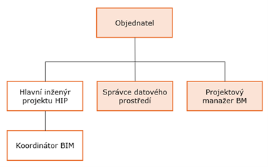
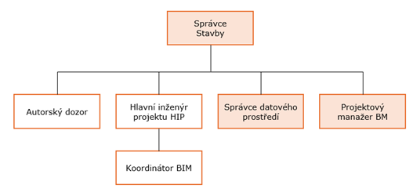

# PŘEDBĚŽNÝ PLÁN REALIZACE BIM (PRE-BEP)
**Projekt**: `[Název projektu]`

**Objednatel**: `[Název objednatele]`

**Zhotovitel**: `[Název zhotovitele]`

**Verze**: V.01

# Obsah

- [1. Úvod](#1-úvod)
  - [1.1. Pojmy a zkratky](#11-pojmy-a-zkratky)
  - [1.2. Použité normy](#12-použité-normy)
- [2. Funkce managementu informací BIM](#2-funkce-managementu-informací-bim)
  - [2.1. Funkce a odpovědnosti při managementu informací BIM](#21-funkce-a-odpovědnosti-při-managementu-informací-bim)
  - [2.2. Organizační struktura](#22-organizační-struktura)
  - [2.3. Kontaktní osoby na straně objednatele](#23-kontaktní-osoby-na-straně-objednatele)
  - [2.4. Kontaktní osoby na straně dodavatele](#24-kontaktní-osoby-na-straně-dodavatele)
- [3. Strategie sdružování a struktura členění](#3-strategie-sdružování-a-struktura-členění)
  - [3.1. Stavební objekty (provozní soubory, inženýrské objekty)](#31-stavební-objekty-provozní-soubory-inženýrské-objekty)
  - [3.2. Profesní části projektu](#32-profesní-části-projektu)
- [4. Vysokoúrovňová matice odpovědnosti](#4-vysokoúrovňová-matice-odpovědnosti)
- [5. Strategie předávání informací realizačního týmu](#5-strategie-předávání-informací-realizačního-týmu)
  - [5.1. Přístup realizačního týmu k plnění EIR pověřující strany](#51-přístup-realizačního-týmu-k-plnění-eir-pověřující-strany)
  - [5.2. Složení realizačního týmu](#52-složení-realizačního-týmu)
- [6. Dodatky a změny projektového informačního standardu](#6-dodatky-a-změny-projektového-informačního-standardu)
- [7. Dodatky a změny projektových metod a postupů pro vytváření informací](#7-dodatky-a-změny-projektových-metod-a-postupů-pro-vytváření-informací)
- [8. Rozpis nasazení software](#8-rozpis-nasazení-software)
  - [8.1. Řešení pro společné datové prostředí (CDE)](#81-řešení-pro-společné-datové-prostředí-cde)
  - [8.2. Ostatní digitální nástroje](#82-ostatní-digitální-nástroje)

# 1. Úvod

Tento dokument je určen k řízení tvorby projektu metodou BIM, k popsání konkrétních kroků k naplnění cílů a očekávání. Dokument navazuje na [dokument EIR](EIR.md) (Požadavky na výměnu informací) a popisuje konkrétní kroky k jejich naplnění na straně dodavatele.

Předběžný plán realizace BIM (PRE-BEP) obsahuje:

- jména a profesní životopisy jednotlivců, kteří budou plnit funkce při managementu informací jménem realizačního týmu;
- strategii předávání informací realizačního týmu obsahující:
  - přístup realizačního týmu k plnění požadavků na výměnu informací;
  - okruh cílů k dosažení pomocí společného vytváření informací;
  - přehled o organizační struktuře realizačního týmu a jeho obchodních vztazích; a
  - přehled o složení realizačního týmu ve formě jednoho nebo více úkolových týmů;
- strategii sdružování, kterou bude realizační tým uplatňovat;
- vysokoúrovňovou matici odpovědnosti realizačního týmu obsahující rozdělení odpovědností za každou součást informačního modelu a klíčové výstupy spojené s těmito součástmi;
- jakékoliv navržené dodatky nebo změny projektových metod a postupů pro vytváření informací, které realizační tým požaduje pro umožnění efektivity při:
  - zachycení existujících informací o aktivu;
  - tvoření, přezkoumávání, schvalování nebo autorizování informací;
  - zabezpečení a distribuci informací; a
  - předávání informací;
- jakékoliv navržené dodatky nebo změny projektového informačního standardu, které realizační tým požaduje pro umožnění efektivity při:
  - výměně informací mezi úkolovými týmy;
  - distribuci informací externím stranám; nebo
- navržený rozpis nasazení software (včetně verzí), hardware a IT infrastruktury, které realizační tým zamýšlí používat.

## 1.1. Pojmy a zkratky

| **Pojem / Zkratka** | **Definice** |
|---|---|
| **Dodavatel / Zhotovitel** | Strana uvedená ve smlouvě, která nabízí poskytnutí dodávek, služeb nebo stavebních prací a je Dodavatelem dle zákona. Dodavatel je vedoucí pověřenou stranou dle ČSN EN ISO 19650. |
| **Koordinátor BIM** | Osoba na straně Dodavatele odpovědná za kontrolu plnění požadavků na informace v rámci managementu informací s využitím metody BIM. |
| **Objednatel** | Strana uvedená ve smlouvě, která přijala nabídku zhotovitele a je zadavatelem podle zákona o zadávání veřejných zakázek. Objednatel je pověřující stranou dle ČSN EN ISO 19650. |
| **Projektový manažer BIM** | Osoba na straně Objednatele odpovědná za kontrolu plnění požadavků na informace v rámci managementu informací s využitím metody BIM. |
| **Projektový tým** | Všechny osoby účastnící se projektu na straně objednatele, zhotovitele (zhotovitelů) a subdodavatelů / podzhotovitelů. |
| **Realizační tým** | Všechny osoby účastnící se na projektu na straně zhotovitele a jeho subdodavatelů. V rámci projektového týmu je jeden nebo více realizačních týmů. |
| **Správce datového prostředí** | Osoba na straně Objednatele odpovědná za správu a provoz společného datového prostředí (CDE). |
| **Subdodavatel / Podzhotovitel** | Strana poskytující dodávky Dodavateli. Subdodavatel / Podzhotovitel je pověřenou stranou podle ČSN EN ISO 19650. |
| **Úkolový tým** | Všechny osoby účastnící se na projektu na straně jednoho subdodavatele. V rámci realizačního týmu je zpravidla jeden nebo více úkolových týmů. |
| **BEP** | Plán realizace BIM (BIM Execution Plan). |
| **BIM** | Informační modelování staveb (Building Information Modeling). |
| **BIM protokol** | Dokument, který stanovuje pravidla pro zajištění efektivní výměny dat prostřednictvím digitální platformy CDE v rámci BIM projektu a upravuje práva a povinnosti Objednatele, Zhotovitele a dalších uživatelů. |
| **CDE** | Společné datové prostředí (Common Data Environment). |
| **EIR** | Požadavky na výměnu informací (Exchange Information Requirements); pojem nahradil starší Požadavky objednatele na informace (Employers Information Requirements). |

## 1.2. Použité normy

Tento dokument vychází z částí níže uvedených norem.

Je-li se v tomto dokumentu odvoláváno na ustanovení normy, týká se to pouze přímo uvedeného ustanovení, nikoliv celého znění normy.

| **Norma** | **Název** |
|---|---|
| **ČSN EN ISO 19650** | Organizace a digitalizace informací o budovách a inženýrských stavbách včetně informačního modelování staveb (BIM) (soubor norem). |
| **ČSN EN 17817-1** | Informační modelování staveb – Úroveň informačních potřeb – Část 1: Pojmy a principy. |
| **ČSN EN ISO 16739** | Datový formát Industry Foundation Classes (IFC) pro sdílení dat ve stavebnictví a facility managementu. |
| **ČSN EN ISO 12006** | Budovy a inženýrské stavby – Organizace informací o stavbách. |

# 2. Funkce managementu informací BIM

## 2.1. Funkce a odpovědnosti při managementu informací BIM

### 2.1.1. Funkce a odpovědnosti na straně Objednatele

| **Role BIM** | **Funkce a odpovědnosti** |
|---|---|
| **Projektový manažer objednatele** | Odpovědnost za dohled nad plněním závazků vyplývajících ze smluvních vztahů se zhotovitelem. |
| **Projektový manažer BIM** | odsouhlasení BEP vytvořeného zhotovitelem, odsouhlasení změn BEP; kontrola dodržování dokumentu EIR a BEP v rámci projektového týmu; kontrola předávaných dat zhotovitelem dle BEP včetně finální kontroly před předáním; související služby, jejichž potřeba vznikne v návaznosti na úpravu BEP v průběhu realizace projektu; aktivní účast při řešení vzniklých problémů a návrh jejich řešení; zodpovídá přímo projektovému řízení na straně objednatele; neschvaluje a neprojednává dotazy zhotovitele týkající se technického řešení z hlediska řešení projektu. |
| **Správce datového prostředí** | správa společného datového prostředí pro celý projektový tým v celém průběhu projektu; školení uživatelů související s používáním CDE; odpovědný za vytváření procesních matic v prostředí CDE. |

### 2.1.2. Funkce a odpovědnosti na straně Dodavatele

| **Role BIM** | **Funkce a odpovědnosti** |
|---|---|
| **Hlavní inženýr projektu (HIP)** | řízení projektu na straně zhotovitele; vypracovává projektové standardy, které doplňují chybějící standardy v BEP a předkládá je k odsouhlasení Koordinátorovi BIM; zodpovídá za správnost projektové dokumentace. |
| **Koordinátor BIM** | vypracovává BEP dle šablony objednatele; vede projektové týmy dle odsouhlaseného EIR a BEP; kontroluje naplnění informačních modelů, vyhodnocuje správnosti dat obsažených v informačním modelu a předává projektovému manažerovi BIM; aktivně předkládá návrhy změn BEP; kontroluje naplňování cílů projektu k milníkům projektu; propojení jednotlivých modelů na datové bázi; odpovědnost za koordinaci informačních modelů; zodpovídá se HIP zakázky. |
| **Vedoucí modelář** | řízení modelářů v rozsahu definovaném dle BEP; vytváří projektové standardy, které doplňují chybějící standardy v BEP a předkládá je k odsouhlasení Koordinátorovi BIM; zodpovídá za správnost informačního modelu za dané profesní části. |
| **Modelář** | Osoba, která vytváří informační model dle vnitřních směrnic zhotovitele/subdodavatele a dle BEP. |

## 2.2. Organizační struktura

*[Vložit organizační diagram zachycující také jednotlivé role Uživatelů na straně Zhotovitele, náplň činností a odpovědnosti za konkrétní aktivity včetně jednotlivých fází plnění povinností. Vybrat jeden ze dvou níže.]*

  

  

## 2.3. Kontaktní osoby na straně objednatele

Kontaktní osoby na straně objednatele odpovídají osobám uvedeným v Požadavků na výměnu informací (EIR).

| **Role BIM** | **Organizace** | **Jméno** | **E-mail** |
|---|---|---|---|---|
| **Projektový manažer BIM** |  |  |  |
| **Správce datového prostředí** |  |  |  |
| **Správce stavby** |  |  |  |

## 2.4. Kontaktní osoby na straně Dodavatele

Kontaktní osoby na straně subdodavatelů, autorů jednotlivých částí modelů, jsou uvedeny v kap. [5.2](#52-složení-realizačního-týmu).

| **Role BIM** | **Organizace** | **Jméno** | **E-mail** |
|---|---|---|---|
| **Koordinátor BIM** |  |  |  |
| **Hlavní inženýr projektu (HIP)** |  |  |  |

# 3. Strategie sdružování a struktura členění

Dílčí model bude zpracován pro:

- každý stavební objekt (resp. provozní soubor),
- každou profesní část projektu

podle níže uvedené struktury projektu. Další členění v rámci jedné profese na více modelů není nijak limitováno.

Modely budou mezi sebou plně zkoordinovány podle Požadavků na výměnu informací (EIR).

## 3.1. Stavební objekty (provozní soubory, inženýrské objekty)

| **SO/PS/IO** | **Popis** |
|---|---|
| **SO01** | Hlavní objekt |
|  |  |
|  |  |

*POZN. 1: Tabulku doplní Zhotovitel dle struktury projektu.*

## 3.2. Profesní části projektu

| **Označení** | **Popis** |
|---|---|
| **ASR** | Architektonicko-stavební část |
| **STA** | Stavebně-konstrukční část |
| **VZT** | Vzduchotechnika |
| **CHL** | Rozvody chladu |
| **UT** | Rozvody tepla |
| **ZTI** | Zdravotně-technické instalace |
| **ESI** | Silnoproudá elektrotechnika |
| **ESL** | Slaboproudá elektrotechnika |
| **EPS** | Elektronická požární signalizace |
| **EZS** | Poplachové zabezpečovací a tísňové systémy |
| **EKV** | Vstupní systémy |
| **VS** | Vyvolávací systémy |
| **KAM** | Kamerové systémy |
| **MAR** | Měření a regulace |
| **PBR** | Požárně bezpečnostní řešení stavby |
| **SOZ** | Samočinné odvětrávací zařízení, odvod tepla a kouře |
| **SHZ** | Stabilní hasící systém (nebo GHZ – plynový systém) |
| **POP** | Potrubní pošta |

# 4. Vysokoúrovňová matice odpovědnosti

Vysokoúrovňová matice odpovědnosti obsahuje odpovědnost jednotlivých úkolových týmů za jednotlivé části dle navržené struktury.

**R** – odpovědná osoba

|  | Úkolový tým 1 | Úkolový tým 2 | Úkolový tým 3 | Úkolový tým 4 |
|---|---|---|---|---|
| **SO01** |  |  |  |  |
| **ASR** | R |  |  |  |
| **STA** |  | R |  |  |
| **VZT** |  |  | R |  |
| **CHL** |  |  | R |  |
| **UT** |  |  |  |  |
| **ZTI** |  |  |  |  |
| **ESI** |  |  |  |  |
| **ESL** |  |  |  |  |
| **EPS** |  |  |  |  |
| **EZS** |  |  |  |  |
| **EKV** |  |  |  |  |
| **VS** |  |  |  |  |
| **KAM** |  |  |  |  |
| **MAR** |  |  |  |  |
| **PBR** |  |  |  |  |
| **SOZ** |  |  |  |  |
| **SHZ** |  |  |  |  |
| **POP** |  |  |  |  |

*POZN. 1: Chybějící matice pro provozní soubory a inženýrské objekty doplní zhotovitel.*

# 5. Strategie předávání informací realizačního týmu

## 5.1. Přístup realizačního týmu k plnění EIR pověřující strany

*[Popis splnění požadavků (např. to, co je v rámci požadavků na informace, projektovém informačním standardu nebo metod a postupů uvedeno, že navrhne Dodavatel).]*

## 5.2. Složení realizačního týmu

*[Vložit seznam úkolových týmů, jejich složení, odpovědnosti a kontaktní informace.]*

# 6. Dodatky a změny projektového informačního standardu

Níže uvedené odsouhlasené dodatky a změny projektového informačního standardu doplňují a nahrazují příslušné znění projektového informačního standardu v Požadavků na výměnu informací (EIR).

*[Zde uvést případné dodatky a změny]*

# 7. Dodatky a změny projektových metod a postupů pro vytváření informací

Níže uvedené odsouhlasené dodatky a změny projektových metod a postupů pro vytváření informací doplňují a nahrazují příslušné znění projektových metod a postupů pro vytváření informací v Požadavků na výměnu informací (EIR).

*[Zde uvést případné dodatky a změny]*

# 8. Rozpis nasazení software

## 8.1. Řešení pro společné datové prostředí (CDE)

Společné datové prostředí je implementováno na straně Objednatele.

| **Název aplikace** | **Verze** | **Účel použití** | **Formát** |
|---|---|---|---|
|  |  |  |  |
|  |  |  |  |

## 8.2. Ostatní digitální nástroje

V průběhu projektu budou používány verze projekčních a modelovacích aplikací, ve kterých byla zahájena práce; nebude docházet k aktualizacím na vyšší verze a migracím modelů. Dílčí aktualizace aplikací v rámci verzí (například bezpečnostní aktualizace) jsou možné v případě, že nepovedou k migraci modelů.

| **Název aplikace** | **Verze** | **Účel použití** | **Formát** |
|---|---|---|---|
|  |  |  |  |
|  |  |  |  |
|  |  |  |  |
|  |  |  |  |
|  |  |  |  |
|  |  |  |  |